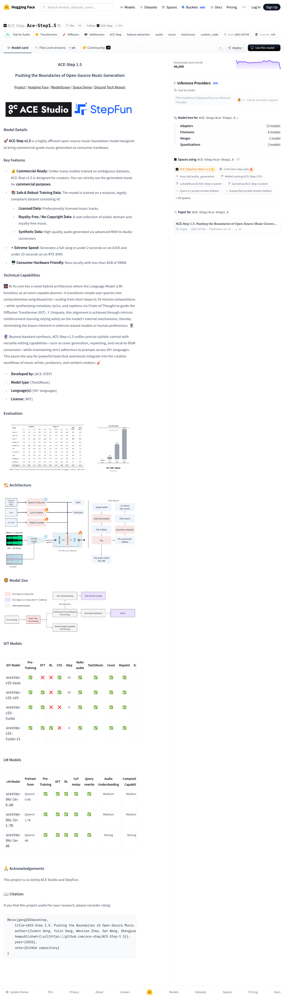

# Visited: https://huggingface.co/ACE-Step/Ace-Step1.5
**Time:** Mon May 11 13:28:18 UTC 2026

## Screenshot

## Raw HTML
[page.html](./page.html)

## Downloaded Media (5 files)
## Downloaded Media Files

## Other Links
- [#dit-models](#dit-models)
- [#evaluation](#evaluation)
- [#key-features](#key-features)
- [#lm-models](#lm-models)
- [#model-details](#model-details)
- [#technical-capabilities](#technical-capabilities)
- [#🏗️-architecture](#🏗️-architecture)
- [#📖-citation](#📖-citation)
- [#🙏-acknowledgements](#🙏-acknowledgements)
- [#🦁-model-zoo](#🦁-model-zoo)
- [/](/)
- [/ACE-Step](/ACE-Step)
- [/ACE-Step/Ace-Step1.5](/ACE-Step/Ace-Step1.5)
- [/ACE-Step/Ace-Step1.5/colab](/ACE-Step/Ace-Step1.5/colab)
- [/ACE-Step/Ace-Step1.5/discussions](/ACE-Step/Ace-Step1.5/discussions)
- [/ACE-Step/Ace-Step1.5/kaggle](/ACE-Step/Ace-Step1.5/kaggle)
- [/ACE-Step/Ace-Step1.5/tree/main](/ACE-Step/Ace-Step1.5/tree/main)
- [/ACE-Step/Ace-Step1.5?library=transformers](/ACE-Step/Ace-Step1.5?library=transformers)
- [/datasets](/datasets)
- [/docs](/docs)
- [/docs/hub/model-cards#specifying-a-base-model](/docs/hub/model-cards#specifying-a-base-model)
- [/enterprise](/enterprise)
- [/front/build/kube-87b6ff9/style.css](/front/build/kube-87b6ff9/style.css)
- [/huggingface](/huggingface)
- [/join](/join)
- [/js/script.js](/js/script.js)
- [/login](/login)
- [/models](/models)
- [/models?library=acestep](/models?library=acestep)
- [/models?library=diffusers](/models?library=diffusers)
- [/models?library=safetensors](/models?library=safetensors)
- [/models?library=transformers](/models?library=transformers)
- [/models?other=audio](/models?other=audio)
- [/models?other=base_model:adapter:ACE-Step/Ace-Step1.5](/models?other=base_model:adapter:ACE-Step/Ace-Step1.5)
- [/models?other=base_model:finetune:ACE-Step/Ace-Step1.5](/models?other=base_model:finetune:ACE-Step/Ace-Step1.5)
- [/models?other=base_model:merge:ACE-Step/Ace-Step1.5](/models?other=base_model:merge:ACE-Step/Ace-Step1.5)
- [/models?other=base_model:quantized:ACE-Step/Ace-Step1.5](/models?other=base_model:quantized:ACE-Step/Ace-Step1.5)
- [/models?other=custom_code](/models?other=custom_code)
- [/models?other=feature-extraction](/models?other=feature-extraction)
- [/models?other=music](/models?other=music)
- [/models?other=text2music](/models?other=text2music)
- [/models?pipeline_tag=text-to-audio](/models?pipeline_tag=text-to-audio)
- [/papers/2602.00744](/papers/2602.00744)
- [/pricing](/pricing)
- [/privacy](/privacy)
- [/spaces](/spaces)
- [/spaces/ACE-Step/Ace-Step-v1.5](/spaces/ACE-Step/Ace-Step-v1.5)
- [/spaces/Davex256/LocalAI-Amlan-Edition](/spaces/Davex256/LocalAI-Amlan-Edition)
- [/spaces/Gamahea/ACE-Step-Custom](/spaces/Gamahea/ACE-Step-Custom)
- [/spaces/LububMusicAi/ACE-Step-Custom](/spaces/LububMusicAi/ACE-Step-Custom)

## Stats
- Links: 79
- Media: 5
